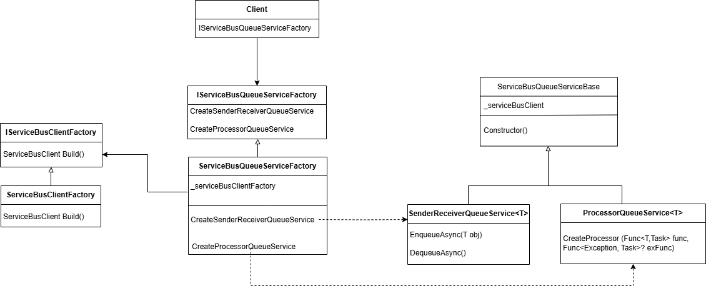
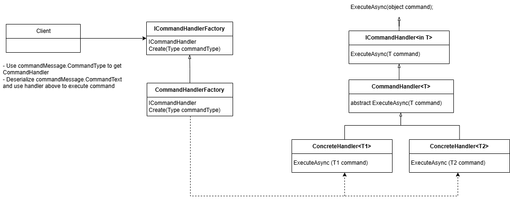

[Azure Service Bus](https://learn.microsoft.com/en-us/azure/service-bus-messaging/service-bus-messaging-overview) is a messaging service on the Microsoft Azure platform that enables reliable and asynchronous message delivery between applications. This is a sample project demonstrating how to use Azure Service Bus to send and receive messages.

### Prerequisites
- **Azure Account**: You need an Azure subscription. If you don't have one, you can create a free account [here](https://azure.microsoft.com/free/).
- **Azure Service Bus Namespace**: Create an Azure Service Bus Namespace in the Azure Portal.
- **.NET Core SDK**: This sample uses .NET Core. Make sure you have the SDK 8.0 installed. You can download it [here](https://dotnet.microsoft.com/download).

### Introduction
- **AVH.MessageBroker.AzureMessaging**: The modules encapsulate functions from  *Azure.Messaging.ServiceBus*, making them more convenient to use.
  - Create queue if it is not exist
  - Use Sender-Receiver to send message, customize error handling, retries, and completion based on application logic.
  - Use Processor to simplifies receiving and processing messages by automatically handling concurrency, message locks, retries and errors.

  
- **AVH.MessageBroker.Common**: Contains constants and common functions.
- **AVH.MessageBroker.Framework**: Includes common NuGet packages used across other projects.
- **AVH.MessageBroker.Models**: Includes models and command messages.
- **AVH.MessageBroker.Services**: Create handlers to process and execute command messages received from queues.

- **AVH.MessageBroker.Sender**: Use to send messages to queue.
- **AVH.MessageBroker.Worker**: Use to handle message by creating handler then executing the command message.

### Configuration
- Send message to queue by using Sender-Receiver: Update properties in *AzureServiceOption* including *ConnectionString*, *QueuePrefix*, *Queues.Name* in [appsettings.json](AVH.MessageBroker.Sender/appsettings.json) in **AVH.MessageBroker.Sender**
- Handle messages from queue by Processor: Update properties in *AzureServiceOption* including *ConnectionString*, *QueuePrefix*, *Queues.Name* in [appsettings.json](AVH.MessageBroker.Worker/appsettings.json) in **AVH.MessageBroker.Worker**